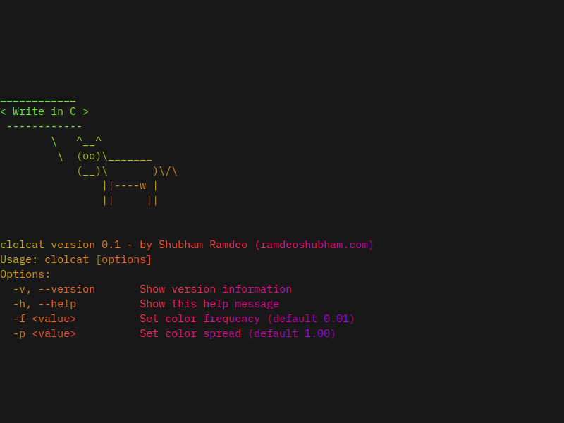

# clolcat 🌈

A small, fast C implementation of lolcat for rainbow-colored terminal output.



---

## Features

- Rainbow-colored output using **ANSI truecolor codes**
- Random starting color for each run
- Optional flags:
  - `-v` / `--version` : Show version and author
  - `-f <value>`       : Set color frequency (default: 0.01)
  - `-p <value>`       : Set color spread (default: 1.0)
  - `-h` / `--help`    : Show this help message
- No delays; instant output
- Easy to install in user space, no `sudo` required

---

## Installation

Clone the repository and run the installer:

```bash
git clone https://github.com/ramdeoshubham/clolcat.git
cd clolcat
bash install.sh
````

This will compile `clolcat` and move it to `~/bin/`.  
If `~/bin` is not in your PATH, the installer will add it to your shell configuration.

---

## Usage

Pipe text to `clolcat`:

```bash
echo "Hello Kitty!" | clolcat
cat myfile.txt | clolcat
```

Optional flags:

```bash
clolcat -v         # Show version
clolcat -h         # Show help
clolcat -f 0.2     # Set frequency
clolcat -p 4.0     # Set spread
clolcat -f 0.2 -p 4.0 < file.txt
```

---

## Uninstall

Since it is installed entirely in user space you just need to:

```bash
rm ~/bin/clolcat
```

That's it. 

---

## License

MIT License © 2025 Shubham Ramdeo 

This project is inspired by the original [lolcat](https://github.com/busyloop/lolcat) utility.


